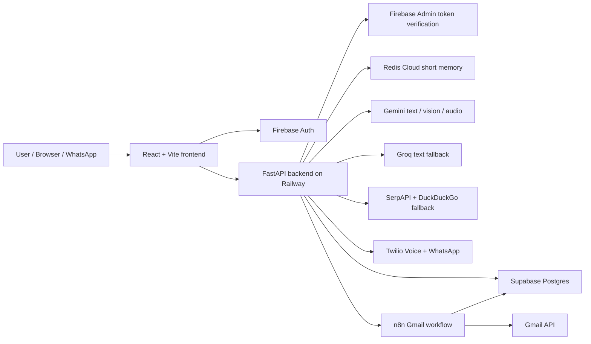
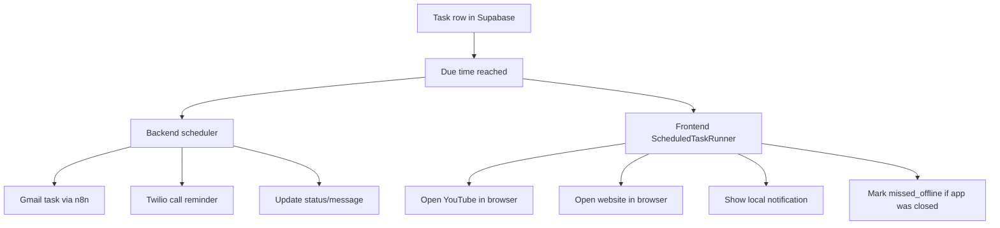
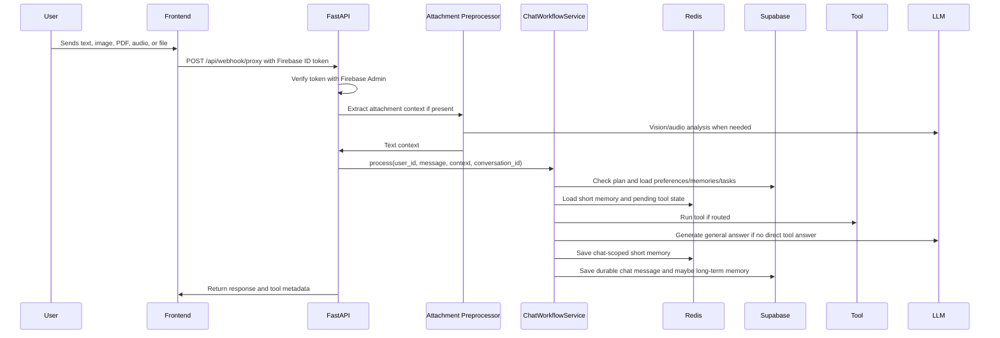
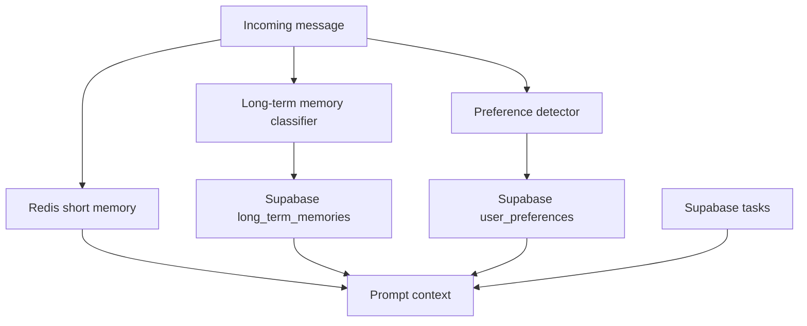

# AgentCoolie Project Knowledge File

Last updated: 2026-05-16

This file is meant to be a memory capsule for the project. It explains what the application became, how it evolved, why certain technical decisions were made, what bugs were discovered, what worked, what did not work, and how to explain the system in interviews or viva discussions months later.

It intentionally reads like a project story rather than a normal README. The README explains how to run the app. This file explains how the app was built, why it was built that way, and what lessons came from the debugging journey.

Important security note: do not store real API keys, Twilio tokens, Supabase service keys, OAuth secrets, Redis URLs, or user phone numbers inside this file. Keep those only in environment variables, Railway variables, Supabase `app_secrets`, or a private password manager.

---

## 1. Project In One Sentence

AgentCoolie is a personal AI agent workspace that combines chat, memory, task automation, live web search, Gmail operations, WhatsApp access, file understanding, and phone-call reminders into one authenticated application.

The application is not just a chatbot. It acts more like a small personal agent system:

- It remembers recent conversation context per chat using Redis.
- It stores durable long-term memories and personalization preferences in Supabase.
- It can route requests to tools such as web search, Gmail, task creation, YouTube opening, website opening, PDF extraction, image analysis, audio transcription, WhatsApp, and Twilio calls.
- It separates browser-only work from backend-executable work.
- It has free and paid-like modes, with backend-enforced quotas.
- It is deployed as a real web app with Firebase Hosting and Railway.

The most important engineering theme of this project was reliability. Many features worked individually at first, but the real challenge was making them work together without leaking users' data, confusing one chat with another, crashing on provider limits, or executing tool actions at the wrong time.

---

## 2. Current High-Level Architecture



The current deployment model is:

- Frontend: Firebase Hosting.
- Backend: Railway, running FastAPI through Docker.
- Database: Supabase Postgres.
- Short memory: Redis Cloud.
- Gmail workflow: n8n hosted separately on Railway.
- Auth: Firebase Authentication plus backend Firebase Admin verification.
- AI: Gemini first, Groq fallback for text generation.
- Web search: SerpAPI first, DuckDuckGo/RSS fallback.
- Calls and WhatsApp: Twilio.

---

## 3. Repository Mental Model

The repository contains both frontend and backend:

```text
.
|-- backend/
|   |-- app/
|   |   |-- agents/       LLM-facing agent behavior
|   |   |-- core/         config, request body limits
|   |   |-- models/       Pydantic schemas
|   |   |-- routes/       FastAPI routers
|   |   `-- services/     Supabase, Redis, AI, tools, plans, scheduler
|   |-- sql/              Supabase schema and migration files
|   |-- Dockerfile
|   |-- railway.toml
|   `-- requirements.txt
|-- client/
|   |-- public/
|   `-- src/
|       |-- components/
|       |-- contexts/
|       |-- hooks/
|       |-- lib/
|       `-- pages/
|-- shared/
|-- call-reminder-test/   Standalone Twilio reminder test harness
|-- firebase.json
|-- package.json
|-- vite.config.ts
`-- README.md
```

Important backend files:

- `backend/app/main.py`: creates FastAPI app, registers routers, starts in-process call task scheduler.
- `backend/app/core/config.py`: environment configuration using Pydantic settings.
- `backend/app/routes/youtube.py`: main `/api/webhook/proxy` chat/file endpoint, YouTube detection, attachment preprocessing.
- `backend/app/routes/chat.py`: simpler chat endpoints and chat memory deletion.
- `backend/app/routes/reminders.py`: task/reminder API used by the Tasks page.
- `backend/app/routes/tasks.py`: task CRUD API.
- `backend/app/routes/integrations.py`: settings integrations such as Gmail/WhatsApp/call settings.
- `backend/app/routes/oauth.py`: Google OAuth flow for Gmail.
- `backend/app/routes/whatsapp.py`: Twilio WhatsApp webhook handling.
- `backend/app/routes/billing.py`: demo billing and plan switch flow.
- `backend/app/services/chat_workflow_service.py`: central router for chat, tools, memory, preferences, Gmail, task creation, and response persistence.
- `backend/app/services/task_intent_service.py`: natural language task parser.
- `backend/app/services/task_execution_service.py`: execution helpers for due tasks.
- `backend/app/services/call_task_scheduler.py`: in-process backend scheduler for due server-side tasks.
- `backend/app/services/plan_service.py`: Companion/Autopilot quotas and usage accounting.
- `backend/app/services/redis_memory_service.py`: chat-scoped short memory and pending tool state.
- `backend/app/services/long_term_memory_service.py`: important memory extraction and storage.
- `backend/app/services/supabase_service.py`: all Supabase operations.
- `backend/app/services/runtime_config_service.py`: runtime secrets from Supabase `app_secrets`.
- `backend/app/services/ai_service.py`: Gemini/Groq key rotation and AI calls.
- `backend/app/services/n8n_service.py`: Gmail workflow calls.
- `backend/app/services/web_search_service.py`: SerpAPI and fallback search.
- `backend/app/services/call_reminder_service.py`: Twilio voice call behavior.

Important frontend files:

- `client/src/App.tsx`: app providers, protected routes, layout.
- `client/src/contexts/AuthContext.tsx`: Firebase auth, Google sign-in, token retrieval.
- `client/src/contexts/ChatContext.tsx`: chat state and conversation isolation.
- `client/src/lib/api.ts`: authenticated API helper.
- `client/src/pages/Chat.tsx`: main chat page.
- `client/src/pages/Tasks.tsx`: reminder/task dashboard.
- `client/src/pages/Settings.tsx`: Gmail, WhatsApp, call reminder settings.
- `client/src/pages/Personalization.tsx`: user preferences.
- `client/src/pages/Checkout.tsx`: demo upgrade flow.
- `client/src/components/ScheduledTaskRunner.tsx`: browser-side execution runner for reminders, website opens, YouTube opens, and offline/missed status.
- `client/src/components/WebsiteOpener.tsx`: browser opening support.

---

## 4. Evolution Story

This is the most important section for interviews. It explains how the project evolved and why the final architecture exists.

### Phase 1: Basic Assistant Application

The project started as a personal assistant/chat application with:

- React frontend.
- FastAPI backend.
- Firebase authentication.
- Supabase storage.
- Gemini for LLM responses.
- A Tasks page.

At this stage the goal was simple: let a user log in, chat with an assistant, and manage reminders.

The first important realization was that a "chatbot" is not enough for the use case. A personal assistant must perform actions. That meant the app needed:

- authenticated API calls,
- task persistence,
- tool routing,
- file upload handling,
- memory,
- and external integrations.

This moved the design from "assistant" toward "agent".

### Phase 2: Security Review And Basic Reliability Fixes

The first deeper review found several high-risk issues:

- Task update/delete was vulnerable to IDOR because routes authenticated a user but did not scope mutations by `user_id`.
- Supabase service-role mutations updated/deleted by task id only. Since service-role bypasses RLS, caller-side ownership checks became mandatory.
- Public webhook endpoints could spend AI quota or spoof user ids.
- WhatsApp webhook did not validate provider signatures or map phone numbers to internal users.
- Chat route had a missing `settings` import and could crash after generating a response.
- Frontend API helper did not attach the real Firebase token.
- YouTube detection had a wrong Gemini call signature and silently failed.
- Frontend Tasks page expected `/api/reminders` and SSE endpoints that were not implemented yet.

The key lesson was that once the backend uses a privileged Supabase service key, every route must explicitly enforce user ownership. RLS cannot protect service-role code.

Important decision:

> Keep using the Supabase service role on the backend for simplicity and full control, but make every service method accept `user_id` and filter by both `id` and `user_id` for user-owned records.

Why this decision was reasonable:

- The backend is trusted server code.
- It avoids exposing service keys to the client.
- It makes complex server-side actions easier.

Tradeoff:

- The burden moves to backend code. If a route forgets `user_id`, it can become an IDOR.

### Phase 3: Authentication And Token Flow

The app uses Firebase Auth for login and Supabase for database storage. This means there are two identities to think about:

- Firebase UID: the true authenticated user id.
- Supabase rows: store that Firebase UID in `user_id`.

This caused early issues:

- The frontend stored local user info but not the real Firebase ID token.
- API calls returned 401 because protected backend routes expected `Authorization: Bearer <firebase-id-token>`.
- Firebase token verification initially used invalid clock skew values.
- Google sign-in failed until the correct authorized domains were added in Firebase.
- A provider-order bug caused `useAuth must be used within an AuthProvider`.

The final rule became:

> The frontend must always call `currentUser.getIdToken()` and send that token. The backend must verify the token with Firebase Admin and derive `user_id` from the verified token only.

This prevents user spoofing through request body fields like `userId`.

### Phase 4: Redis Short-Term Memory

At first the assistant had little real memory. The user wanted "last 5 conversations" to go into the main agent. Redis was selected for short-term memory.

Why Redis:

- Fast reads/writes.
- Natural TTL support.
- Easy list operations for last N messages.
- Better fit than Supabase for volatile recent context.

Important design detail:

Short memory must be chat-specific, not user-global.

Early behavior showed that when the user asked "what was my last question?" in a different chat, the answer could come from another chat. That was wrong because each chat should feel isolated.

Final Redis key model:

```text
coolie:short-memory:{user_id}:{conversation_id}
coolie:tool-state:{user_id}:{conversation_id}:{tool}
```

Decision:

> Use Redis for per-chat short memory and pending multi-turn tool state, while using Supabase for durable long-term memory.

Why this matters:

- Chat A and Chat B should not mix their last-turn context.
- Pending Gmail or task state should also be chat-scoped.
- Long-term facts, preferences, credentials, and tasks remain user-level because they should apply across all chats.

### Phase 5: Long-Term Memory

The next goal was to remember important facts, not every message. Long-term memory was stored in Supabase.

Examples of useful memories:

- The user is preparing for IAS.
- The user needs Tamil Nadu politics updates.
- The user studies at a certain college.
- The user prefers no emojis.

The main challenge:

If every similar message is saved, the memory table becomes noisy and duplicates appear.

Fixes included:

- Normalized content for duplicate detection.
- `maybe_save` logic instead of unconditional writes.
- User-scoped long-term memory rows.
- Plan quotas for long-term memory writes.

Decision:

> Save only important memories to Supabase. Keep recent conversational detail in Redis.

Why not save everything?

- It increases cost and noise.
- It can make future prompts too large.
- It can accidentally preserve unimportant or temporary statements.

Future improvement:

Use embeddings and retrieval so only relevant long-term memories are injected. For now, important memories are passed more broadly.

### Phase 6: Personalization

The user wanted preferences such as:

- tone,
- response length,
- formality,
- emoji usage.

These are stored in `user_preferences`.

The important bug:

When the user said "dont include emojis, i dont like it", the assistant replied that emojis were enabled. The table and personalization page were not updated correctly.

Final approach:

- Detect preference updates in `chat_workflow_service`.
- Upsert them to Supabase.
- Return a direct confirmation response.
- Personalization page reads the same Supabase state.

Decision:

> Personalization should be explicit, durable, and user-controlled. The agent can update it from chat, but it must write to the same table as the UI.

### Phase 7: Task Automation

Tasks became one of the hardest parts because there are several task types:

- normal reminder,
- YouTube open,
- website open,
- Gmail send/reply,
- call reminder,
- WhatsApp-created task.

The first problem was route mismatch. The frontend called `/api/reminders`, but the backend originally had `/api/tasks`. A reminders route was added to match frontend expectations.

The second problem was date/time parsing. Example:

User: "today at 2.05 pm to say to call surya"

Wrong earlier behavior:

- Task saved for the wrong UTC/local time.
- It immediately showed missed/offline.
- The title was wrong or too generic.

Fixes:

- Use `APP_TIMEZONE`, defaulting to Asia/Kolkata.
- Parse "today", "tomorrow", "in 30 minutes", "at 2.05 pm", etc.
- Prefer the action after time expressions.
- Normalize due dates to timezone-aware ISO strings.

The third problem was multi-task parsing:

Example:

User: "create a task to send hi to ram and another task to open aayasher song"

Bad behavior:

- It collapsed into one title like "pm".
- It created only one task.
- It sometimes executed a Gmail send immediately instead of scheduling it.

Fixes:

- Detect "another task" and "task1/task2" style language.
- Split multi-task messages into separate task items.
- Give task intent priority over Gmail action if the user says "create task".
- Store the intended action metadata so execution later can do the right thing.

Decision:

> Task creation must be parsed before direct tool execution. "Create a task to send email" is not the same as "send email now".

### Phase 8: Task Execution Split

A central design realization:

The backend cannot open a tab on the user's browser. Only the frontend can do browser-local actions.

So task execution was split:



Backend runner:

- `call_task_scheduler.py`
- runs as an in-process `asyncio` polling loop on FastAPI startup,
- handles server-executable due tasks,
- claims tasks before side effects.

Frontend runner:

- `ScheduledTaskRunner.tsx`
- runs only when the user has the app open,
- handles local notifications and browser tab opening,
- marks missed/offline if the app was closed at due time.

Decision:

> Use a simple in-process scheduler plus frontend runner for now, not Celery.

Why not Celery yet:

- Faster to ship.
- Fewer moving parts.
- Railway single-service deployment was enough for prototype scale.

Tradeoff:

- In-process schedulers become risky with multiple backend replicas.
- Long-running retries and exactly-once guarantees are weaker.

Future improvement:

Move server-executable jobs to Celery, RQ, Dramatiq, Cloud Tasks, or a managed queue.

### Phase 9: Gmail Integration

Gmail became a serious integration because it involves:

- OAuth,
- refresh tokens,
- user-specific credentials,
- send/read/search operations,
- safe confirmation flows,
- and plan gating.

Two approaches were considered:

1. Implement Gmail API calls directly in backend code.
2. Use n8n as a Gmail workflow tool.

The app uses n8n for Gmail operations.

Why n8n:

- Easier to visualize and modify workflows.
- Can isolate Gmail tool execution from the main backend.
- Useful if more automation workflows are added later.

Downsides:

- Harder debugging because errors can be in app code, n8n workflow, OAuth, Supabase credentials, or Gmail API.
- Requires webhook secrets and careful user mapping.
- Workflow JSON can become large and hard to maintain.

Important Gmail bugs:

- OAuth was not configured at first.
- Redirect URI confusion between frontend and backend domains.
- `SESSION_SECRET_KEY` had to be strong and stable for OAuth state signing.
- Credentials appeared connected in UI but were not stored.
- Gmail action said "not connected" because `user_credentials` row was missing.
- Email send returned raw JSON to the user.
- "can u send hi to ..." sent the whole command text as the email body.
- Multi-turn leave-letter flow drafted but did not actually send after confirmation.

Final behavior:

- Gmail is available only in Autopilot mode.
- User connects Gmail in Settings.
- OAuth callback stores credentials in Supabase.
- Chat workflow checks Gmail status before tool use.
- For send actions, the assistant composes a clean subject/body.
- Confirmation flows keep pending Gmail state in Redis per chat.
- n8n returns structured result, which the backend formats into user-friendly text like "Email sent to recipient."

Decision:

> Tool outputs should be human-formatted before reaching the chat UI. The user should not see raw workflow JSON unless debugging.

### Phase 10: WhatsApp Access

The user wanted to access AgentCoolie from WhatsApp.

Twilio WhatsApp Sandbox was used.

Important design challenge:

If two users message the same Twilio WhatsApp number, how does the backend know which app account each phone belongs to?

Solution:

- Store phone-to-user mapping in Supabase `user_credentials`.
- Settings page lets the logged-in user save/connect their WhatsApp number.
- Incoming Twilio webhook extracts the sender phone number.
- Backend maps sender phone to Firebase user id.
- If no mapping exists, it should refuse or ask user to connect first.

Important bug:

The WhatsApp flow created a task but also sent an email immediately. This happened because the router treated "create task to send email" as Gmail execution instead of scheduled task creation.

Fix:

- Task intent detection gets priority when task language is present.
- Gmail action only runs immediately if the user is not asking to create/schedule a task.

Decision:

> Multi-channel entry points should share the same core chat workflow, but must still preserve channel-specific identity mapping and tool confirmation rules.

### Phase 11: Phone Call Reminders

The user wanted critical tasks to trigger a phone call because app notifications and email reminders may be missed.

Twilio Voice was used.

Before integrating into the main app, a separate `call-reminder-test/` harness was kept. That was a good decision because it allowed isolated testing without breaking the main app.

Important constraints:

- Twilio trial accounts can call only verified numbers.
- Trial calls include Twilio limitations.
- Wrong or unverified numbers should not show raw provider errors to users.

Fix:

- Store call reminder number in settings.
- Validate and format phone numbers.
- Convert Twilio errors into friendly messages.
- Show failure status in the task page.
- Include task details in the spoken reminder message instead of generic text.

Decision:

> Critical call reminders are useful but should be explicit and quota-limited because they involve real phone calls and external cost.

### Phase 12: Web Search

The app initially told the user it had no real-time search. That was unacceptable for queries like "recent news about Tamil Nadu politics."

Final search design:

- SerpAPI is primary because it is more reliable for real search.
- DuckDuckGo/RSS is fallback because it is free.
- The router detects current/recent/live queries.
- Search results are summarized by the agent.

Decision:

> Use paid/API search first for reliability, free search as fallback for resilience.

Tradeoff:

- SerpAPI needs a key and quota.
- DuckDuckGo can be inconsistent and may block or return weak results.

### Phase 13: YouTube And Website Opening

The user wanted commands like:

- "open amazon"
- "open aayasher song"
- "play it"

Important lesson:

The backend cannot open browser tabs. It can only return target URLs. The frontend must open the tab or same-window location.

Earlier bugs:

- YouTube/website opened in two tabs.
- Assistant said "new tabs are blocked" even when a tab opened.
- "play it" lost context because the previous YouTube result was not preserved well.
- Scheduled YouTube tasks showed completed but did not open because server-side execution cannot open a browser.

Fixes:

- Return structured tool metadata to frontend.
- Let frontend own browser opening.
- Avoid duplicate opening paths.
- Store task type and metadata for scheduled browser actions.

Decision:

> Browser effects belong to frontend. Backend should decide intent and return metadata; frontend should execute UI/browser actions.

### Phase 14: File Uploads

The app supports:

- images,
- PDFs,
- audio.

Implementation:

- `youtube.py` `/api/webhook/proxy` accepts JSON and multipart.
- Images go to Gemini vision.
- PDFs are extracted with `pypdf` and then summarized/used as context.
- Audio is transcribed with Gemini audio, then passed into the normal router.

Important bugs:

- Pillow was missing, causing image upload to crash with `No module named PIL`.
- Large PDFs could exceed fallback model token limits.
- Gemini quota errors returned 500.
- Expired Gemini keys caused voice upload to fail.

Fixes:

- Add `Pillow` and `pypdf` requirements.
- Enforce upload size and attachment count.
- Limit PDF pages by plan.
- Add provider key rotation through runtime secrets.
- Add graceful error responses for quota/key failures.

Decision:

> File preprocessing should happen before the main agent. The main agent should receive extracted context, not raw binary files.

### Phase 15: Runtime Secrets And Key Rotation

At first, changing API keys required redeploying the backend. That was slow and inconvenient.

The app added Supabase `app_secrets` for runtime provider keys:

- `GOOGLE_AI_API_KEYS`
- `GEMINI_VISION_API_KEYS`
- `GROQ_API_KEYS`
- other provider-level runtime config

Why this matters:

- If one key hits quota, the app can rotate to another.
- Expired keys can be disabled/replaced without Railway redeploy.
- It separates operational key management from code deployment.

Decision:

> Store provider key pools in `app_secrets`, not hardcoded code. Environment variables remain base configuration; app_secrets handles runtime rotation.

Security warning:

Only the backend should read `app_secrets`. Never expose this table to the frontend.

### Phase 16: Plans, Billing, And Feature Gating

The app added two modes:

- AgentCoolie Companion: free mode.
- AgentCoolie Autopilot: pro/demo paid mode.

Why plans were added:

- AI calls and Twilio calls cost money.
- Free users should not access Gmail/WhatsApp if those are pro features.
- Feature limits prevent abuse.
- It makes the app look like a complete product.

Plan enforcement belongs in the backend:

- `plan_service.py` defines quotas and caps.
- Backend checks and consumes usage.
- Frontend only displays UI state.

Important bugs:

- Free users could still enter Gmail/WhatsApp settings.
- Companion mode allowed more call reminders than intended.
- Gmail sends were possible from free mode.
- New account saw old account data, showing tenant isolation problems.

Fixes:

- Backend plan checks for protected actions.
- UI disables/gates pro-only settings.
- Supabase queries filter by `user_id`.
- Chat history and Redis memory use user id plus conversation id.

Decision:

> Never trust frontend gating. The backend must enforce plan limits and tenant boundaries.

### Phase 17: Deployment

Deployment ended up with:

- Firebase Hosting for frontend.
- Railway for backend.
- Railway for n8n.
- Supabase and Redis Cloud as managed services.

Important deployment issues:

- CORS blocked deployed frontend until `agentcoolie.web.app` was allowed.
- Firebase project rename did not automatically change hosting URL. Firebase Hosting URLs depend on site id, not display name.
- Google sign-in failed until `agentcoolie.web.app` was added to authorized domains.
- Gmail OAuth required backend callback URI, not frontend callback URI.
- Railway deploy sometimes failed due snapshot issues; retrying worked.
- Production OAuth required strong `SESSION_SECRET_KEY`.

Decision:

> Keep production secrets in Railway variables and runtime provider pools in Supabase `app_secrets`.

---

## 5. Request Flow In Detail

The main chat/file endpoint is `/api/webhook/proxy`.



The central workflow order is important:

1. Verify authenticated user.
2. Extract text from attachments.
3. Check plan usage.
4. Apply preference updates if message asks for them.
5. Resolve pending multi-turn tool state.
6. Detect task creation before direct Gmail execution.
7. Detect tool requests such as Gmail, search, YouTube, website.
8. Load Redis short memory for that conversation.
9. Load long-term memory and preferences.
10. Call AI or tool.
11. Save messages and memory.

---

## 6. Data Model Mental Model

Supabase tables used by the application:

| Table | Purpose |
| --- | --- |
| `chat_messages` | Durable user/assistant messages, scoped by user and conversation |
| `tasks` | Reminders and scheduled action tasks |
| `long_term_memories` | Important durable user facts |
| `user_preferences` | Tone, length, formality, emoji preference |
| `user_credentials` | Gmail/WhatsApp/call connection data |
| `user_plans` | Companion/Autopilot mode |
| `usage_events` | Daily/monthly usage tracking |
| `app_secrets` | Runtime provider secrets/key pools |
| `notifications` | User notification records |

Key rule:

Every user-owned table must be filtered by `user_id`.

This is especially important because the backend uses Supabase service role. Service role bypasses Row Level Security, so the backend must enforce ownership.

---

## 7. Memory Design



Short-term memory:

- stored in Redis,
- scoped by user id and conversation id,
- TTL based,
- only last N turns injected,
- deleted when a chat is deleted/cleared.

Long-term memory:

- stored in Supabase,
- user-level,
- applies across chats,
- intended for important facts only,
- should eventually be retrieved by relevance instead of always injected.

Preferences:

- stored in Supabase,
- explicitly user-controllable,
- can be changed from UI or chat.

Why this split is good:

- Redis keeps prompts small and recent.
- Supabase keeps durable user facts.
- Conversation isolation prevents one chat leaking into another.

---

## 8. Tool Routing Philosophy

The app should decide whether a message is:

- a general question,
- a live web search,
- a task creation request,
- a Gmail action,
- a YouTube/website open request,
- a file analysis request,
- a preference update,
- a pending confirmation response,
- or a mixed request.

The hardest class is mixed requests. Examples:

- "create a task to send hi to ram"
- "send leave letter tomorrow at 10"
- "open a song and remind me later"
- image plus text question
- PDF followed by follow-up question
- WhatsApp message that asks to create a task but contains an email address

The central rule that came from debugging:

> Intent words like "create task", "remind me", "schedule", and due-time expressions should take priority over direct tool execution.

This prevents the agent from sending an email immediately when the user actually asked to create a future task.

---

## 9. Free vs Pro Product Design

The current product modes are:

- AgentCoolie Companion: free, limited.
- AgentCoolie Autopilot: pro/demo paid, larger quotas and tools.

Exact numbers are defined in `backend/app/services/plan_service.py`.

Important design reason:

Feature limits are not just monetization. They are also safety and cost controls.

Examples:

- AI chat messages cost provider quota.
- Image/audio/PDF uploads can be large and expensive.
- Gmail and WhatsApp are sensitive integrations.
- Phone calls can cost money and disturb users.
- Long-term memory writes can pollute context.

Backend enforcement:

- Required for every paid/limited action.
- Frontend gating is only UX.
- Usage events are stored in Supabase.

Known limitation:

The current `consume_usage_quota` RPC may be missing in Supabase in some deployments, so the backend falls back to a local lock plus `usage_events` counting. This works for single-instance/light usage, but the RPC should exist for robust atomic usage enforcement.

Future improvement:

Use a proper atomic Postgres function and unique constraints for quota windows.

---

## 10. What Worked Well

### Firebase Auth + FastAPI verification

Firebase Auth worked well for frontend login and Google sign-in. Backend verification with Firebase Admin gave a reliable `uid` that could be used as `user_id` everywhere.

### Supabase as relational backend

Supabase worked well because the app has relational user data:

- tasks,
- chat messages,
- credentials,
- preferences,
- plans,
- usage events.

SQL migrations also made it easier to reason about schema.

### Redis for short memory

Redis was a good fit for chat-scoped volatile context. It avoided overusing Supabase for rapidly changing recent messages.

### Runtime secrets in Supabase

Storing AI key pools in `app_secrets` solved the "redeploy for every key change" problem.

### Separate call-reminder test harness

Testing Twilio calls separately before integrating reduced risk. Keeping `call-reminder-test/` is useful for future projects too.

### Frontend/backend task execution split

This was the correct architecture because browser actions cannot be done by the backend.

---

## 11. What Did Not Work Initially

### Trusting body `userId`

Any endpoint that trusts `userId` from JSON can be abused. The correct source is the verified Firebase token.

### Assuming service-role Supabase is protected by RLS

Supabase service role bypasses RLS. Backend code must filter by `user_id`.

### Treating "create task to send email" as Gmail send

This caused immediate sends when the user wanted scheduled tasks.

### Putting all short memory under user id only

This caused one chat to know another chat's last message.

### Letting provider errors bubble to 500

Provider quota/key failures are normal operational events. They should become friendly user-visible messages, not app crashes.

### Trying to make backend open browser tabs

The backend can return a URL. The browser must open it.

### Thinking Firebase project display name controls hosting URL

Firebase Hosting URL is based on hosting site id, not display name.

### OAuth redirect confusion

For Gmail OAuth, the redirect URI must point to the backend OAuth callback, not the frontend page.

---

## 12. Bug And Fix Knowledge Base

| Problem | Root Cause | Fix / Lesson |
| --- | --- | --- |
| Task IDOR | Mutations filtered only by task id | Filter by `id` and `user_id` |
| Supabase service-role owner bypass | Service role bypasses RLS | Treat backend as full-trust and enforce ownership |
| Public AI webhook abuse | Unauthenticated endpoint trusted request body | Require Firebase auth and derive user id from token |
| WhatsApp spoofing risk | Webhook lacked provider verification | Validate Twilio signature and map phone to user |
| Chat crashed after LLM response | Missing `settings` import | Import/configure dependencies explicitly |
| API calls 401 | Frontend did not attach Firebase token | Use `getIdToken()` in API helper |
| YouTube detection always false | Wrong Gemini method args | Use explicit prompt and parse structured response |
| Tasks page route failures | Frontend/backend route mismatch | Add `/api/reminders` compatibility |
| Firebase token clock error | Invalid clock skew | Keep allowed skew in Firebase Admin supported range |
| Auth provider crash | `ChatProvider` used `useAuth` outside provider | Reorder providers and pass `userId` safely |
| Google sign-in unauthorized | Domain missing in Firebase authorized domains | Add production hosting domain |
| Gmail not connected after OAuth | Credentials not stored or wrong callback | Store in `user_credentials`, check backend callback URI |
| Raw Gmail JSON shown | n8n result passed directly | Format workflow output before chat response |
| Email body contained command text | Poor intent/entity extraction | Compose clean email subject/body |
| Leave-letter flow never sent | Pending confirmation state lost | Store pending Gmail state in Redis per chat |
| Task wrong time | UTC/local mismatch and parser weakness | Use `APP_TIMEZONE` and better fallback parser |
| Multi-task message collapsed | Parser did not split task items | Add multi-task extraction |
| WhatsApp task sent immediately | Gmail route outranked task intent | Prioritize task creation |
| New user saw old data | Missing user scoping/local state leakage | Filter by `user_id` and isolate frontend auth state |
| Free users used pro tools | UI-only gating | Backend plan checks |
| YouTube opened twice | Duplicate frontend opening paths | Single structured tool metadata path |
| Image upload 500 | Gemini quota bubbled up | Catch provider errors and return friendly response |
| Voice upload failed | Expired Gemini key | Classify key errors and rotate/fail gracefully |
| Missing Pillow | Requirement not installed | Add `Pillow` to backend requirements |
| Large PDF overload | Too much extracted text | Plan-based page limits and truncation |
| Railway CORS failures | Production origin not allowed | Add Firebase hosting domains to CORS |
| OAuth production failure | Weak/default session secret | Require strong `SESSION_SECRET_KEY` |

---

## 13. Interview-Ready Explanations

### What is the difference between an assistant and an agent?

An assistant mainly responds to user prompts. It may answer questions, summarize text, or give suggestions.

An agent goes further:

- It understands intent.
- It chooses tools.
- It can take actions.
- It maintains state and memory.
- It can execute workflows across systems.
- It can ask for missing information and continue later.

AgentCoolie is closer to an agent because it can create tasks, send Gmail through a tool, search live web, open websites, remember preferences, process files, handle WhatsApp messages, and trigger phone reminders.

### Why did you use Firebase Auth instead of Supabase Auth?

Firebase Auth was already a good fit for frontend login and Google sign-in. It provides mature client SDKs and easy ID token retrieval. Supabase was used for database storage. The backend verifies Firebase ID tokens and stores Firebase UID as `user_id` in Supabase.

Tradeoff: two systems must be integrated carefully. Every Supabase row must use Firebase UID consistently.

### Why use Supabase with service role?

The backend needs to perform server-side operations across tables, including workflows, tasks, credentials, and usage tracking. Service role simplifies backend access. The tradeoff is security responsibility: every backend query must filter by `user_id`.

### Why Redis for short-term memory?

Recent chat memory is volatile and needs TTL. Redis is fast, simple, and ideal for "last N messages." Supabase is better for durable records, not every short-lived memory operation.

### Why separate short-term and long-term memory?

Short-term memory keeps conversation flow. Long-term memory stores durable important facts. If everything is long-term, prompts become noisy and privacy risk increases. If everything is short-term, useful user facts disappear.

### Why n8n for Gmail instead of direct Gmail API code?

n8n made Gmail workflows easier to visualize, test, and extend. It separates automation from the core backend. The downside is extra infrastructure and harder debugging. If the app becomes larger, direct Gmail code or a dedicated tool-service might be more maintainable.

### Why no Celery?

The project currently uses an in-process `asyncio` scheduler because it is simple and works for one Railway backend instance. Celery/RQ/Dramatiq would be better for large scale or exactly-once job execution, but they add Redis queue setup, worker processes, and deployment complexity.

### How do tasks run if the user closes the app?

Server-executable tasks can run from the backend scheduler. Examples: Gmail send, Twilio call.

Browser-only tasks cannot run if the user's browser is closed. Examples: open YouTube, open website, local notification. The Tasks page can mark those as missed/offline when the app reopens.

### Why cannot the backend open YouTube for the user?

The backend runs on Railway. It has no access to the user's browser. It can only return a URL. The frontend, running in the user's browser, must open the tab.

### How did you handle provider quota failures?

AI provider failures are treated as expected operational states:

- classify key errors and retryable errors,
- rotate through key pools,
- cool down failing keys,
- return a clear response for attachment analysis failures instead of 500.

### How do you prevent one user's data from leaking to another?

- Backend derives `user_id` from verified Firebase token.
- Supabase queries filter by `user_id`.
- Redis keys include `user_id` and `conversation_id`.
- User credentials are mapped to specific user ids.
- Frontend clears auth/local user state on sign out.
- Plan and tool checks are backend-side.

### What is the hardest part of this project?

The hardest part was not building one feature. It was making many features interact safely:

- chat plus memory,
- task creation plus Gmail,
- WhatsApp plus user identity,
- scheduled tasks plus browser limitations,
- provider key failures plus uploads,
- free/pro gating plus backend security.

### What would you improve next?

Top improvements:

1. Replace in-process scheduler with a real queue/worker system.
2. Add atomic Supabase usage quota RPC everywhere.
3. Add embedding-based memory retrieval.
4. Add structured LLM router with tool schemas.
5. Move Gmail from n8n to a typed internal tool service if workflow complexity grows.
6. Add automated integration tests for task parsing, Gmail confirmation, WhatsApp mapping, and plan gating.
7. Add admin dashboard for runtime secrets and provider health.
8. Move from deprecated `google.generativeai` to the newer Gemini SDK.

---

## 14. Senior Engineering Lessons

### 1. Tool execution must be explicit

The assistant should not perform dangerous actions just because a message contains an email address or command verb. It must distinguish:

- "send this now"
- "draft this"
- "create a task to send this later"
- "remind me to send this"

### 2. State must be scoped correctly

The project has several state scopes:

- global app config,
- user-level memory/preferences/credentials,
- conversation-level short memory,
- pending tool state,
- task-level execution state.

Most subtle bugs came from using the wrong scope.

### 3. Provider failures are normal

AI APIs hit quota, keys expire, models reject payloads, and network calls fail. A production app should degrade gracefully.

### 4. Frontend and backend have different powers

Backend can securely call databases and APIs. Frontend can open tabs, access microphone, and show browser notifications. Design must respect that boundary.

### 5. UI gating is not security

Hiding a button in React does not protect the backend. Every protected action must be checked in FastAPI.

### 6. Service-role keys are dangerous

They are powerful and useful, but every query must be reviewed for tenant isolation.

### 7. Natural language time parsing is harder than it looks

Phrases like "today at 2.05 pm to call Surya" are easy for humans but tricky for regex/LLM parsers. Timezone awareness is mandatory.

### 8. Multi-channel agents need identity mapping

In browser, identity comes from Firebase. In WhatsApp, identity comes from phone number. These must map to the same internal `user_id`.

---

## 15. Deployment Runbook

Backend local checks:

```powershell
C:\Users\saiki\AppData\Local\Programs\Python\Python312\python.exe -m compileall -q backend\app
C:\Users\saiki\AppData\Local\Programs\Python\Python312\python.exe backend\test_imports.py
```

Frontend local checks:

```powershell
npm.cmd run check
npm.cmd run build
```

Backend deploy:

```powershell
cd backend
& "$env:APPDATA\npm\railway.cmd" up --detach
& "$env:APPDATA\npm\railway.cmd" status
curl.exe -sS https://agentcoolie-backend-production.up.railway.app/health
```

Frontend deploy:

```powershell
npm.cmd run build
& "$env:APPDATA\npm\firebase.cmd" deploy --only hosting
```

Useful checks after deploy:

- `/health` should return healthy.
- CORS origins should include production Firebase Hosting domain.
- Firebase authorized domains should include the deployed domain.
- Gmail OAuth redirect URI should point to backend callback.
- `SESSION_SECRET_KEY` should be strong and not default.
- `DEMO_BILLING_ENABLED` should be true only for demo mode.
- Supabase tables and migrations should exist.
- Runtime AI key pools should exist in `app_secrets`.

---

## 16. Common Failure Modes And How To Debug

### Chat returns 401

Likely causes:

- frontend did not send Firebase ID token,
- user signed out,
- Firebase Admin config missing,
- token clock issue.

Check:

- browser network tab Authorization header,
- backend Firebase service logs,
- Railway environment variables.

### Chat returns 500

Likely causes:

- provider key/quota issue,
- unhandled route exception,
- Supabase connectivity issue,
- too-large prompt or attachment.

Check:

- Railway logs,
- `/api/webhook/proxy` logs,
- `ai_service.py` warnings,
- attachment size limits.

### Gmail says not connected

Likely causes:

- `user_credentials` row missing,
- OAuth callback failed,
- n8n credentials workflow failed,
- wrong user id mapping,
- free plan blocked Gmail.

Check:

- Settings page connection status,
- Supabase `user_credentials`,
- backend `/api/integrations/gmail/status`,
- n8n workflow logs.

### WhatsApp replies with Twilio default message

Likely cause:

- Twilio sandbox inbound webhook URL is not configured to backend `/api/whatsapp/webhook`.

Check:

- Twilio WhatsApp Sandbox inbound URL,
- backend public URL,
- Twilio signature validation setting.

### Task created but did not execute

Ask what kind of task it is:

- Gmail/call can execute on backend.
- YouTube/website/local reminders need browser open.

Check:

- task type,
- due date timezone,
- task status,
- frontend ScheduledTaskRunner logs,
- backend scheduler logs.

### New user sees old chats

High severity. Check:

- frontend localStorage state,
- chat query filtering,
- Supabase `user_id` filters,
- Redis key scope,
- conversation id handling.

### Image upload says provider quota exhausted

Likely all Gemini vision keys are exhausted or invalid.

Check:

- `GEMINI_VISION_API_KEYS` in `app_secrets`,
- `GOOGLE_AI_VISION_API_KEY`,
- Railway logs for 429 or API key invalid.

---

## 17. What To Say In A Viva

If asked to introduce the project:

> AgentCoolie is a personal AI agent workspace. It is built with React on Firebase Hosting and FastAPI on Railway. Firebase handles authentication, Supabase stores durable user data, Redis stores chat-scoped short-term memory, Gemini and Groq provide AI generation, SerpAPI/DuckDuckGo provide search, n8n handles Gmail workflows, and Twilio handles WhatsApp and call reminders. The main engineering challenge was not only generating chat responses, but safely routing user intent to tools, preserving memory correctly, scheduling tasks, and enforcing user isolation and plan limits.

If asked why it is an agent:

> It is agentic because it can decide whether to answer normally, search the web, create a task, send Gmail, open a website, process a PDF/image/audio upload, or ask follow-up questions. It also stores memory and uses tool state across turns.

If asked about security:

> The backend verifies Firebase ID tokens and derives the user id from the token. Supabase queries are scoped by user id. Redis memory keys include user id and conversation id. Tool credentials are stored server-side. Plan enforcement is backend-side, not just frontend UI gating.

If asked about reliability:

> I added graceful handling for provider quota/key failures, runtime key rotation through Supabase app_secrets, health checks, upload limits, task status tracking, and fallback search/AI providers. I also split browser-only tasks from server-executable tasks.

If asked about future scaling:

> The biggest scaling change would be replacing the in-process scheduler with a queue worker such as Celery/RQ/Dramatiq or a managed job service. I would also add atomic quota enforcement in Postgres, better observability, and automated integration tests.

---

## 18. Final Project Narrative

AgentCoolie evolved from a simple AI chat app into a personal automation agent. The major learning was that a useful AI product is not just a model call. It needs identity, memory, tools, state, error handling, and safety boundaries.

The architecture became stronger after each bug:

- IDOR bugs forced stronger user scoping.
- Token failures forced correct Firebase ID token flow.
- Memory leakage forced chat-specific Redis keys.
- Gmail mistakes forced careful intent routing and confirmation state.
- WhatsApp mistakes forced phone-to-user mapping.
- Task failures forced a split between backend jobs and browser jobs.
- Provider quota failures forced key rotation and graceful degradation.
- Free/pro leakage forced backend plan enforcement.

The final system is not perfect, but it is a strong full-stack project because it demonstrates real engineering decisions:

- authentication,
- authorization,
- database design,
- background execution,
- external API integrations,
- AI tool routing,
- memory architecture,
- deployment,
- observability,
- and product-level constraints.

The best way to explain it is:

> I built AgentCoolie as a personal AI agent, then hardened it through real bugs. Each feature exposed a reliability or security problem, and the architecture evolved to solve those problems instead of only adding more UI.

